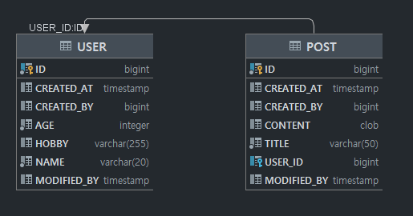

# [미션] Spring Boot JPA로 게시판 구현

## 📌 과제 설명

### **SpringDataJPA 를 설정한다.**

- datasource : h2

### **엔티티를 구성한다**

- 회원(User)
    - id (PK) (auto increment)
    - name
    - age
    - hobby
    - **created_at**
    - **created_by**
- 게시글(Post)
    - id (PK) (auto increment)
    - title
    - content
    - **created_at**
    - **created_by**
- 회원과 게시글에 대한 연관관계를 설정한다.
    - 회원과 게시글은 1:N 관계이다.
- 게시글 Repository를 구현한다. (PostRepository)

### **API를 구현한다.**

- 게시글 조회
    - 페이징 조회 (GET "/posts")
    - 단건 조회 (GET "/posts/{id}")
- 게시글 작성 (POST "/posts")
- 게시글 수정 (POST "/posts/{id}")

### **REST-DOCS를 이용해서 문서화한다.**

## 👩‍💻 요구 사항과 구현 내용

### 엔티티 구조



### API

### /posts/

#### Request

```
GET /posts?page=0&size=10 HTTP/1.1
Content-Type: application/json;charset=UTF-8
Host: localhost:8080
```

| Path                          | Type      | Description      |
| :---------------------------- | :-------- | :--------------- |
| `statusCode`                  | `Number`  | 상태코드         |
| `serverDateTime`              | `String`  | 응답시간         |
| `data`                        | `Object`  | 데이터           |
| `data.content[]`              | `Array`   | 게시글           |
| `data.content[].id`           | `Number`  | 게시글 id        |
| `data.content[].title`        | `String`  | title            |
| `data.content[].content`      | `String`  | content          |
| `data.content[].createdAt`    | `String`  | createdAt        |
| `data.content[].createdBy`    | `Number`  | createdBy        |
| `data.content[].userId`       | `Number`  | userId           |
| `data.pageable`               | `Object`  | 페이징 설정      |
| `data.pageable.sort`          | `Object`  | 페이징 정렬      |
| `data.pageable.sort.empty`    | `Boolean` | empty            |
| `data.pageable.sort.sorted`   | `Boolean` | sorted           |
| `data.pageable.sort.unsorted` | `Boolean` | unsorted         |
| `data.pageable.offset`        | `Number`  | offset           |
| `data.pageable.pageSize`      | `Number`  | pageSize         |
| `data.pageable.pageNumber`    | `Number`  | pageNumber       |
| `data.pageable.unpaged`       | `Boolean` | unpaged          |
| `data.pageable.paged`         | `Boolean` | paged            |
| `data.last`                   | `Boolean` | last             |
| `data.totalElements`          | `Number`  | totalElements    |
| `data.totalPages`             | `Number`  | totalPages       |
| `data.size`                   | `Number`  | size             |
| `data.number`                 | `Number`  | number           |
| `data.sort`                   | `Object`  | 정렬             |
| `data.sort.empty`             | `Boolean` | empty            |
| `data.sort.sorted`            | `Boolean` | sorted           |
| `data.sort.unsorted`          | `Boolean` | unsorted         |
| `data.first`                  | `Boolean` | first            |
| `data.numberOfElements`       | `Number`  | numberOfElements |
| `data.empty`                  | `Boolean` | empty            |

#### Response

```
HTTP/1.1 200 OK
Content-Type: application/json;charset=UTF-8
Content-Length: 734

{
  "statusCode":200,
  "data":
    {
      "content":
        [
          {
            "id":338,
            "title":"테스트 글 첫번째 제목",
            "content":"테스트중인 첫번째 게시글입니다.",
            "createdAt":"2021-10-16T03:33:10.717",
            "createdBy":290,
            "userId":290
          },
          {
            "id":339,
            "title":"테스트 글 두번째 제목",
            "content":"테스트중인 두번째 게시글입니다.",
            "createdAt":"2021-10-16T03:33:10.725",
            "createdBy":290,"userId":290
          }
        ],
      "pageable":
        {
          "sort":
            {
              "empty":true,
              "sorted":false,
              "unsorted":true
            },
          "offset":0,
          "pageNumber":0,
          "pageSize":10,
          "unpaged":false,
          "paged":true
        },
      "last":true,
      "totalElements":2,
      "totalPages":1,
      "size":10,
      "number":0,
      "sort":
        {
          "empty":true,
          "sorted":false,
          "unsorted":true
        },
      "numberOfElements":2,
      "first":true,
      "empty":false
    },
    "serverDateTime":"2021-10-16 03:33:10"
  }
```

| Path                          | Type      | Description      |
| :---------------------------- | :-------- | :--------------- |
| `statusCode`                  | `Number`  | 상태코드         |
| `serverDateTime`              | `String`  | 응답시간         |
| `data`                        | `Object`  | 데이터           |
| `data.content[]`              | `Array`   | 게시글           |
| `data.content[].id`           | `Number`  | 게시글 id        |
| `data.content[].title`        | `String`  | title            |
| `data.content[].content`      | `String`  | content          |
| `data.content[].createdAt`    | `String`  | createdAt        |
| `data.content[].createdBy`    | `Number`  | createdBy        |
| `data.content[].userId`       | `Number`  | userId           |
| `data.pageable`               | `Object`  | 페이징 설정      |
| `data.pageable.sort`          | `Object`  | 페이징 정렬      |
| `data.pageable.sort.empty`    | `Boolean` | empty            |
| `data.pageable.sort.sorted`   | `Boolean` | sorted           |
| `data.pageable.sort.unsorted` | `Boolean` | unsorted         |
| `data.pageable.offset`        | `Number`  | offset           |
| `data.pageable.pageSize`      | `Number`  | pageSize         |
| `data.pageable.pageNumber`    | `Number`  | pageNumber       |
| `data.pageable.unpaged`       | `Boolean` | unpaged          |
| `data.pageable.paged`         | `Boolean` | paged            |
| `data.last`                   | `Boolean` | last             |
| `data.totalElements`          | `Number`  | totalElements    |
| `data.totalPages`             | `Number`  | totalPages       |
| `data.size`                   | `Number`  | size             |
| `data.number`                 | `Number`  | number           |
| `data.sort`                   | `Object`  | 정렬             |
| `data.sort.empty`             | `Boolean` | empty            |
| `data.sort.sorted`            | `Boolean` | sorted           |
| `data.sort.unsorted`          | `Boolean` | unsorted         |
| `data.first`                  | `Boolean` | first            |
| `data.numberOfElements`       | `Number`  | numberOfElements |
| `data.empty`                  | `Boolean` | empty            |

## 게시글 단건 조회

### /posts/{id}

Request

```
GET /posts/337 HTTP/1.1
Content-Type: application/json;charset=UTF-8
Host: localhost:8080
```

| Path             | Type     | Description |
| :--------------- | :------- | :---------- |
| `statusCode`     | `Number` | 상태코드    |
| `serverDateTime` | `String` | 응답시간    |
| `data`           | `Object` | 데이터      |
| `data.id`        | `Number` | 게시글 id   |
| `data.title`     | `String` | title       |
| `data.content`   | `String` | content     |
| `data.createdAt` | `String` | createdAt   |
| `data.createdBy` | `Number` | createdBy   |
| `data.userId`    | `Number` | userId      |

Response

```
HTTP/1.1 200 OK
Content-Type: application/json;charset=UTF-8
Content-Length: 241

{
  "statusCode":200,
  "data":
    {
      "id":337,
      "title":"테스트 글 두번째 제목",
      "content":"테스트중인 두번째 게시글입니다.",
      "createdAt":"2021-10-16T03:33:10.391",
      "createdBy":289,
      "userId":289
    },
  "serverDateTime":"2021-10-16 03:33:10"
}
```

| Path             | Type     | Description |
| :--------------- | :------- | :---------- |
| `statusCode`     | `Number` | 상태코드    |
| `serverDateTime` | `String` | 응답시간    |
| `data`           | `Object` | 데이터      |
| `data.id`        | `Number` | 게시글 id   |
| `data.title`     | `String` | title       |
| `data.content`   | `String` | content     |
| `data.createdAt` | `String` | createdAt   |
| `data.createdBy` | `Number` | createdBy   |
| `data.userId`    | `Number` | userId      |

## 게시글 작성

### /posts/

Request

```
POST /posts/ HTTP/1.1
Content-Type: application/json;charset=UTF-8
Content-Length: 76
Host: localhost:8080

{"title":"제목란입니다.","content":"내용란입니다.","userId":291}
```

| Path      | Type     | Description |
| :-------- | :------- | :---------- |
| `title`   | `String` | title       |
| `content` | `String` | content     |
| `userId`  | `Number` | userId      |

Response

```
HTTP/1.1 200 OK
Content-Type: application/json;charset=UTF-8
Content-Length: 68

{"statusCode":200,"data":342,"serverDateTime":"2021-10-16 03:33:10"}
```

| Path             | Type     | Description |
| :--------------- | :------- | :---------- |
| `statusCode`     | `Number` | 상태코드    |
| `data`           | `Number` | 게시글 id   |
| `serverDateTime` | `String` | 응답시간    |

## 게시글 수정

### /posts/{id}

Request

```
POST /posts/344 HTTP/1.1
Content-Type: application/json;charset=UTF-8
Content-Length: 63
Host: localhost:8080

{"title":"제목란입니다.","content":"내용란입니다."}
```

| Path      | Type     | Description |
| :-------- | :------- | :---------- |
| `title`   | `String` | title       |
| `content` | `String` | content     |

Response

```
HTTP/1.1 200 OK
Content-Type: application/json;charset=UTF-8
Content-Length: 68

{"statusCode":200,"data":345,"serverDateTime":"2021-10-16 03:33:11"}
```

| Path             | Type     | Description |
| :--------------- | :------- | :---------- |
| `statusCode`     | `Number` | 상태코드    |
| `data`           | `Number` | 게시글 id   |
| `serverDateTime` | `String` | 응답시간    |
