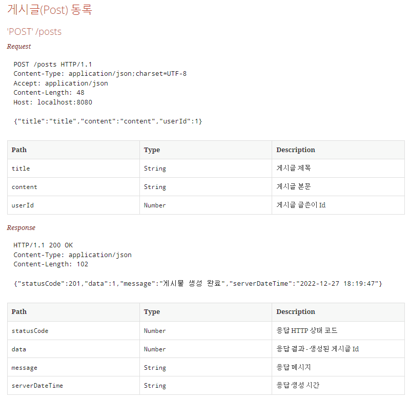
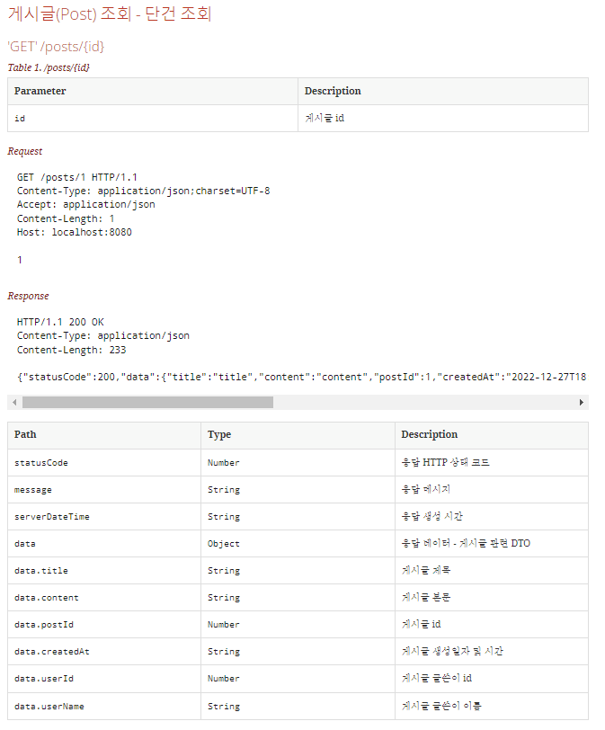
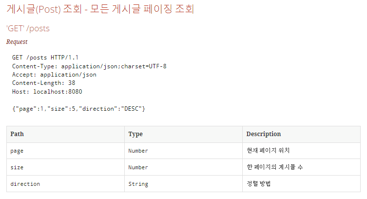
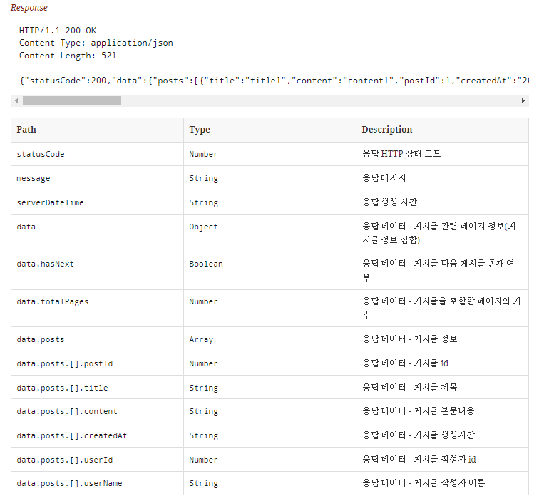
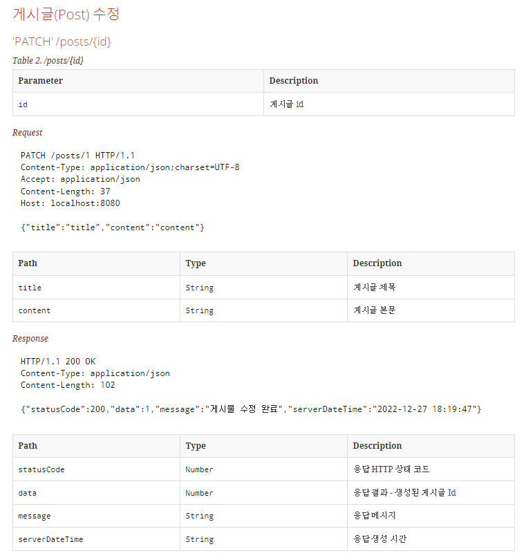

# [미션] Spring Boot JPA로 게시판 구현

## 미션 소개 😎
Spring Boot JPA - Rest API를 강의를 듣고, 게시판 구현 미션을 수행해봅시다.  
**UI는 존재하지 않고 Api만 설계한 프로젝트입니다.**

---

## 👩‍💻 요구 사항 및 구현 내용
- [x]  **SpringDataJPA 를 설정한다.**
    - [x]  datasource : h2 or mysql
- [x]  **엔티티를 구성한다**
    - [x]  회원(User)
        - id (PK) (auto increment)
        - name
        - age
        - hobby
        - **created_at**
        - **created_by** -> **modified_at** 으로 수정
    - [x]  게시글(Post)
        - id (PK) (auto increment)
        - title
        - content
        - **created_at**
        - **created_by** -> **modified_at** 으로 수정
    - [x]  회원과 게시글에 대한 연관관계를 설정한다.
        - 회원과 게시글은 1:N 관계이다.
    - [x]  게시글 Repository를 구현한다. (PostRepository)
- [x]  **API를 구현한다.**
    - [x]  게시글 조회
        - 페이징 조회 (GET "/posts")
        - 단건 조회 (GET "/posts/{id}")
    - [x]  게시글 작성 (POST "/posts")
    - [x]  게시글 수정 (PATCH "/posts/{id}")
- [x]  **REST-DOCS를 이용해서 문서화한다.**

체크박스를 이용하여 주어진 요구사항 중 구현한 요구사항을 표시했습니다.

### 🗺️ ER Diagram

User와 Post(게시글)이 1:N 관계를 가지고 요구사항에 필요했던 필드들을 일부 수정하여 엔티티를 설계했습니다.

### 📄 Api 문서
REST-Docs를 통해 문서화했습니다.  

1️⃣ **게시글(Post) 등록**  
  
2️⃣ **게시글(Post) 단건 조회**  
  
3️⃣ **게시글(Post) 전체 조회 (페이징)**  

  
4️⃣ **게시글(Post) 수정**  

---

## ✅ 프로그램 실행 방법
- 포트번호 : 8000
- localhost:8000 접속 시 api 문서화 페이지가 출력됩니다.

---

## ❓프로젝트 중 직면한 문제점 및 생각, 느낀점
- [JPA 게시판 프로젝트 회고글](https://gnuoyus.tistory.com/84)
