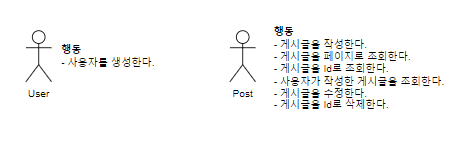
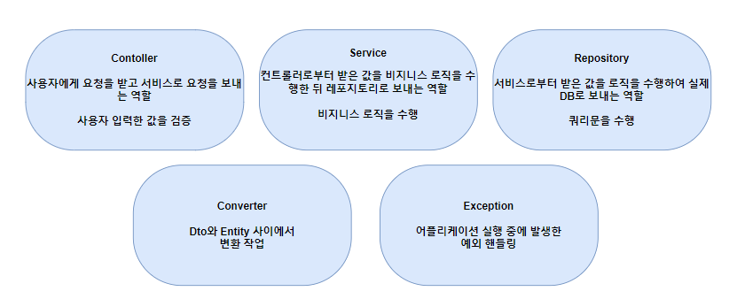
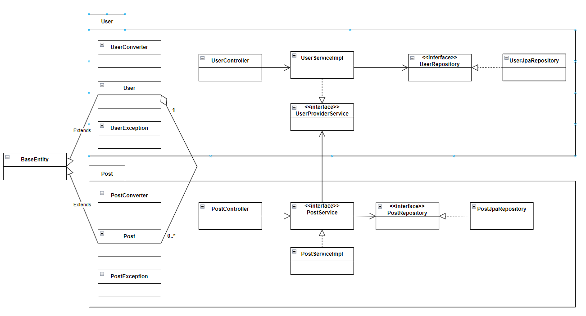

# [미션] Spring Boot JPA로 게시판 구현

## 😎 미션 소개 
Spring Boot JPA - Rest API를 강의를 듣고, 게시판 구현 미션을 수행해봅시다.

## 🤔 그림 그리기 및 소개하기

### 객체의 행동

### 도메인 계층 별 역할 및 책임

### 구조도

## ✅ 작업 목록
- [ ] 🎉 프로젝트 생성
- [ ] 📝 그림그리기 및 작업 목록 작성
- [ ] 🔧 H2 DB 설정 추가
- [ ] ✨ User 엔티티 구현
- [ ] ✨ Post 엔티티 구현
- [ ] ✨ User 생성 기능 구현
- [ ] ✅ User 생성 기능 테스트 코드 구현
- [ ] ✨ Post 생성 기능 구현
- [ ] ✅ Post 생성 기능 테스트 코드 구현
- [ ] ✨ Post Id로 조회 기능 구현
- [ ] ✅ Post Id로 조회 기능 테스트 코드 구현
- [ ] ✨ Post 페이징 조회 기능 구현
- [ ] ✅ Post 페이징 조회 기능 테스트 코드 구현
- [ ] ✨ Post 특정 사용자 게시글 조회 기능 구현
- [ ] ✅ Post 특정 사용자 게시글 조회 기능 테스트 코드 구현
- [ ] ✨ Post 수정 기능 구현
- [ ] ✅ Post 수정 기능 테스트 코드 구현
- [ ] ✨ Post Id로 삭제 기능 구현
- [ ] ✅ Post Id로 삭제 기능 테스트 코드 구현
- [ ] 🔧 REST-DOCS 설정 추가
- [ ] 📝 REST-DOCS 문서 작업
