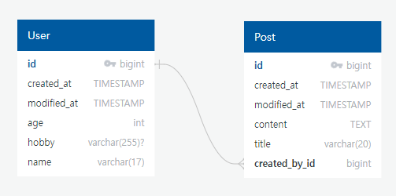

# Spring Boot JPA로 게시판 구현

> Spring Boot + JPA + MySQL


#### 개발환경

```
• IDE : IntelliJ 2020.03
• 개발 언어 : Java 11
• 프레임워크 : SpringBoot 2.5.5
• 영속성 프레임워크 : JPA
• 빌드도구 : Gradle 7.2
• 데이터베이스 : MySQL 8.0.26
```


---


## 기능 요구 사항

- 사용자 상세 정보 조회, 사용자 추가, 사용자 정보 수정, 삭제 API 구현
- 모든 게시글 조회, 특정 사용자의 모든 게시글 조회, 특정 게시글 상세 조회, 게시글 등록, 수정, 삭제 API 구현

- 댓글 등록, 수정, 삭제 API 구현


## API 명세서

#### User(사용자)

|             Action             | Verbs  | URL Pattern |
| :----------------------------: | :----: | :---------: |
|   특정 사용자 정보 조회하기    |  GET   | /users/{id} |
|        사용자 추가하기         |  POST  |   /users    |
|   특정 사용자 정보 수정하기    |  PUT   | /users/{id} |
| 특정 사용자 삭제(비활성화)하기 | DELETE | /users/{id} |


#### Post(게시글)

|               Action               | Verbs  | URL Pattern  |
| :--------------------------------: | :----: | :----------: |
|        모든 게시글 조회하기        |  GET   |    /posts    |
| 특정 사용자의 모든 게시글 조회하기 |  GET   | /posts/users |
|     특정 게시글 상세 조회하기      |  GET   | /posts/{id}  |
|          게시글 등록하기           |  POST  |    /posts    |
|        특정 게시글 수정하기        |  PUT   | /posts/{id}  |
|        특정 게시글 삭제하기        | DELETE | /posts/{id}  |


#### Comment(댓글)

|       Action       | Verbs  |             URL Pattern              |
| :----------------: | :----: | :----------------------------------: |
|   댓글 등록하기    |  POST  |         /posts/{id}/comments         |
| 특정 댓글 수정하기 |  PUT   | /posts/{postId}/comments/{commentId} |
| 특정 댓글 삭제하기 | DELETE | /posts/{postId}/comments/{commentId} |


## ERD




### **REST DOCS**


<br/>

---

#### 구현내용(요구사항)

- 이미 존재하는 사용자만이 게시글과 댓글을 작성할 수 있습니다. 

- 게시글과 댓글은 해당 작성자만 수정하고 삭제할 수 있습니다. 

- 사용자가 탈퇴해도 게시글은 남아있습니다.

- 게시글 삭제 시 댓글까지 함께 삭제됩니다.

- userId가 담긴 dto를 통해 유저정보를 전달하여 존재하는 유저를 확인하는 방식으로 구현하였습니다. 

   - 엔드포인트를 Restful하도록 구현하고 싶기도 하여서 userId를 파라미터로 넘기지 않은 이유도 있습니다.

    

